# Conecta Lactare — App Flutter (MVP)

> Cada gota importa. Cada conexão salva vidas.

MVP navegável do aplicativo **Conecta Lactare**, portado para **Flutter + Dart** a partir da
versão original em Kotlin/Jetpack Compose, com dados mockados (sem integração com API, Firebase
ou banco de dados local nesta sprint), representando o comportamento principal da solução
apresentada no pitch do Challenge Europharma 2026.

## Sobre esta conversão

Este projeto é a portabilidade 1:1 do app Android nativo (Kotlin + Jetpack Compose) para
Flutter, mantendo:

- As mesmas 17 telas, fluxos e regras de negócio;
- Os mesmos dados mockados (doadoras, bancos de leite, coletas, conteúdos educativos, fila de
  avaliação e auditoria), agora em `lib/data/mock/mock_data.dart`;
- A mesma paleta de cores e identidade visual (`#0E4F8A` / `#07335B` / `#E7F1FA`);
- Navegação por abas (bottom navigation) nas áreas de doadora e gestor, com passagem de
  parâmetros entre telas (ex.: `slug` do conteúdo educativo).

**Gerenciamento de estado:** nativo do Flutter (`StatefulWidget` + `setState` para estado local
de tela, e `ChangeNotifier` para o pequeno estado global de sessão — papel logado e respostas do
quiz — em `lib/state/app_state.dart`).

**Navegação:** [go_router](https://pub.dev/packages/go_router), com rotas nomeadas e
`StatefulShellRoute.indexedStack` para as bottom navigation bars da área da doadora e da área do
gestor (equivalente aos grafos aninhados `DoadoraNav.kt` / `GestorNav.kt` da versão Android).

## Objetivo do aplicativo

O Brasil tem a maior rede de bancos de leite humano do mundo (237 bancos + 249 postos de coleta),
mas enfrenta escassez crônica: de 1,6 milhão de nutrizes atendidas por ano, apenas ~12% chegam a
doar. O problema não é falta de vontade — é falta de **conexão**: desconhecimento do processo,
dificuldade de encontrar o banco de leite mais próximo, cadastro burocrático e ausência de
acompanhamento após o cadastro.

O **Conecta Lactare** é um app que conecta mães que amamentam aos bancos de leite humano,
cobrindo a jornada de ponta a ponta:

1. **Onboarding e elegibilidade** — quiz rápido para descobrir se a usuária pode doar.
2. **Cadastro** — formulário simplificado, com preenchimento automático de endereço por CEP.
3. **Triagem** — o cadastro entra em avaliação por uma equipe de saúde (médicos/enfermeiros).
4. **Coletas** — a doadora aprovada sinaliza leite excedente e escolhe o banco de leite mais próximo.
5. **Relacionamento e conteúdo** — acompanhamento do impacto das doações e conteúdo educativo.
6. **Painel do gestor** — visão administrativa com indicadores, fila de avaliação, doadoras,
   coletas e auditoria.

## Telas implementadas

### Área pública
- **Landing** — apresentação da proposta, estatísticas do problema e chamada para ação.
- **Quiz de elegibilidade** — perguntas sim/não com barra de progresso.
- **Resultado (elegível / não elegível)** — feedback imediato de acordo com as respostas do quiz.
- **Cadastro** — formulário de criação de conta com busca de CEP mockada.
- **Login** — acesso mockado (qualquer e-mail/senha), com escolha entre entrar como **doadora**
  ou **gestor(a)**.

### Área da doadora
- **Início** — resumo de impacto, próxima coleta agendada e atalhos rápidos.
- **Minhas coletas** — histórico de coletas com status, volume e opção de cancelar.
- **Sinalizar coleta** — escolha do banco de leite e da modalidade (domiciliar ou presencial).
- **Bancos de leite** — lista de bancos próximos.
- **Conteúdo educativo** — lista de artigos e tela de leitura.
- **Perfil** — dados pessoais e dia fixo de coleta.

### Área do gestor
- **Visão geral** — indicadores da plataforma.
- **Fila de avaliação** — aprovação/reprovação de cadastros pendentes.
- **Doadoras** — listagem de todas as doadoras e seus status.
- **Coletas** — todas as coletas sinalizadas na plataforma.
- **Auditoria** — histórico de ações administrativas.

Todas as telas usam **dados mockados** definidos em `lib/data/mock/mock_data.dart` — as ações de
aprovar/reprovar avaliação, sinalizar/cancelar coleta e editar perfil atualizam esses dados em
memória durante a sessão.

## Screenshots do app em execução

Capturas de tela do app rodando no navegador (`flutter run -d chrome`), cobrindo o fluxo público,
a área da doadora e a área do gestor.

### Área pública

| | |
|---|---|
| 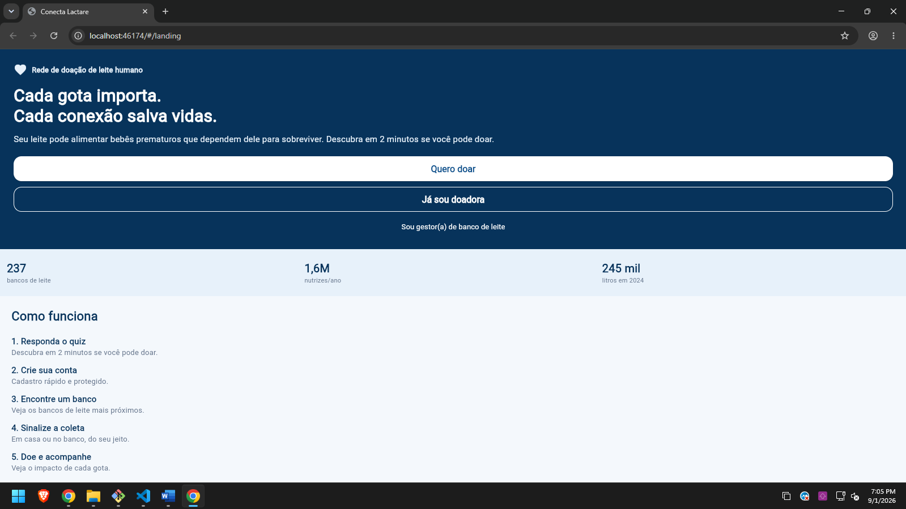 **Landing** — tela de apresentação do app, com a proposta de valor, estatísticas do problema (bancos de leite, nutrizes atendidas, litros doados) e os botões "Quero doar" / "Já sou doadora" / "Sou gestor(a)". | 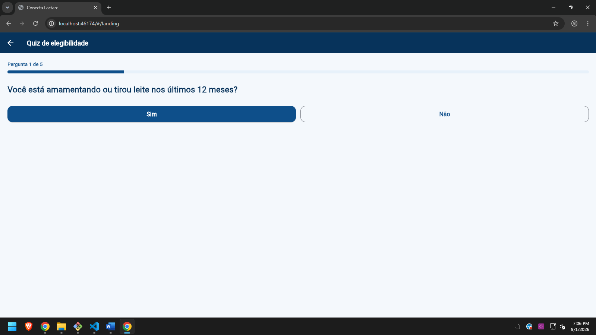 **Quiz de elegibilidade** — perguntas sim/não com barra de progresso ("Pergunta 1 de 5"), usadas para calcular se a usuária pode doar. |
| 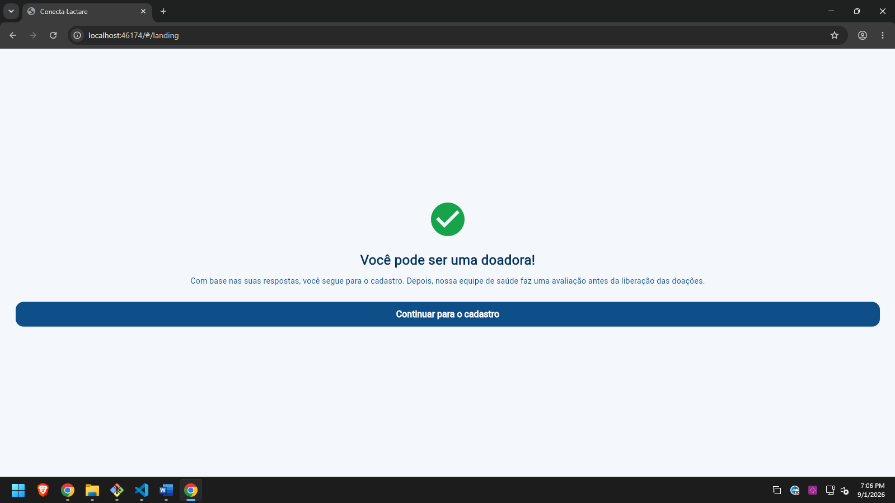 **Resultado do quiz (elegível)** — feedback de que a usuária pode ser doadora, com botão para continuar para o cadastro. | 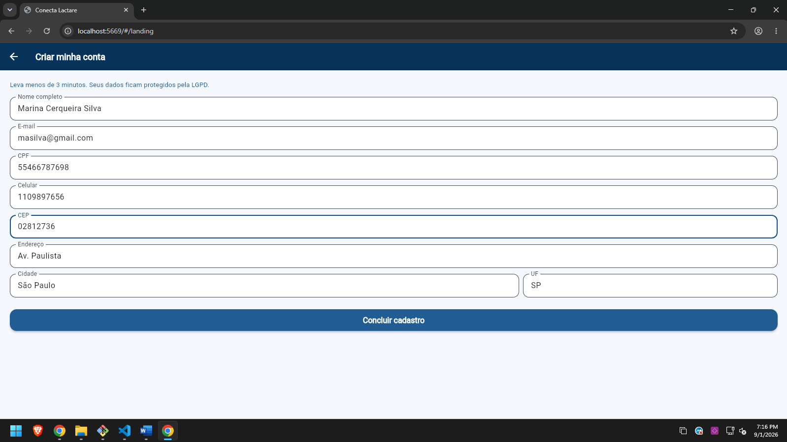 **Cadastro** — formulário de criação de conta (nome, e-mail, CPF, celular, CEP com preenchimento automático mockado de endereço, cidade e UF). |
| 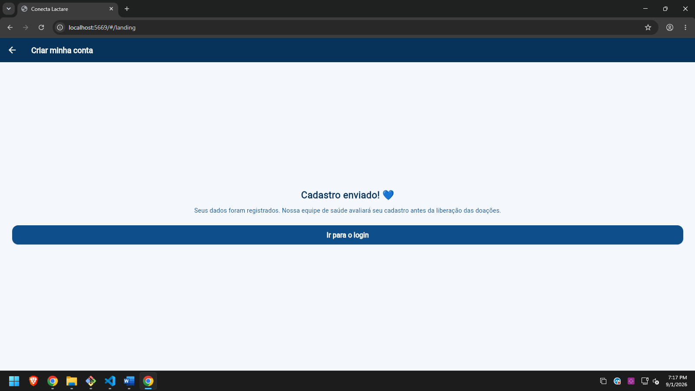 **Cadastro enviado** — confirmação de que os dados foram registrados e que a equipe de saúde fará a avaliação antes da liberação das doações. | 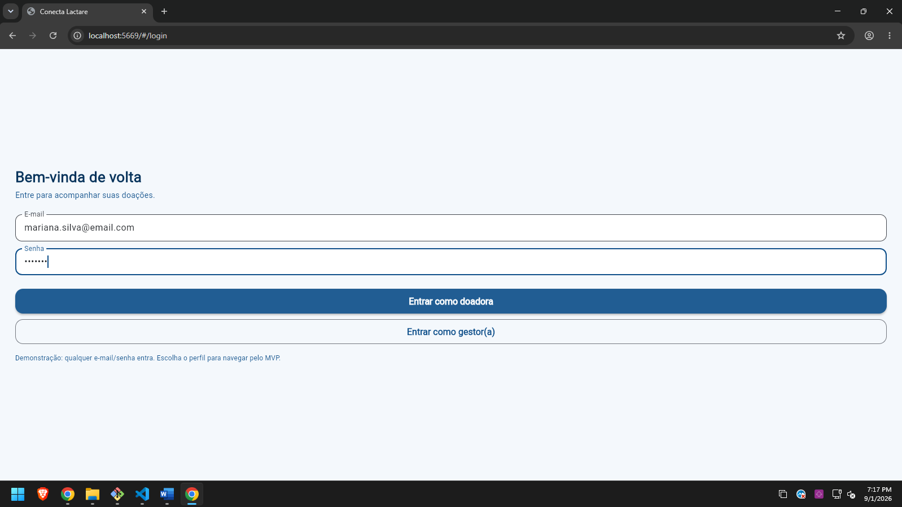 **Login** — acesso mockado (qualquer e-mail/senha), com escolha entre entrar como **doadora** ou **gestor(a)** para demonstrar as duas áreas do app. |

### Área da doadora

| | |
|---|---|
| 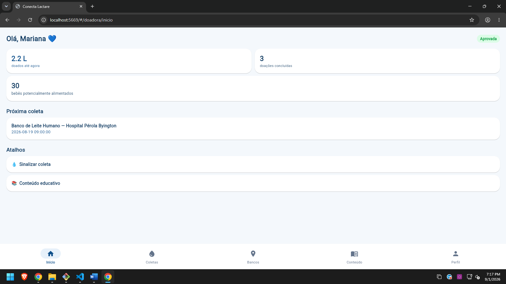 **Início** — saudação personalizada, resumo de impacto (litros doados, doações concluídas, bebês potencialmente alimentados), próxima coleta agendada e atalhos rápidos. | 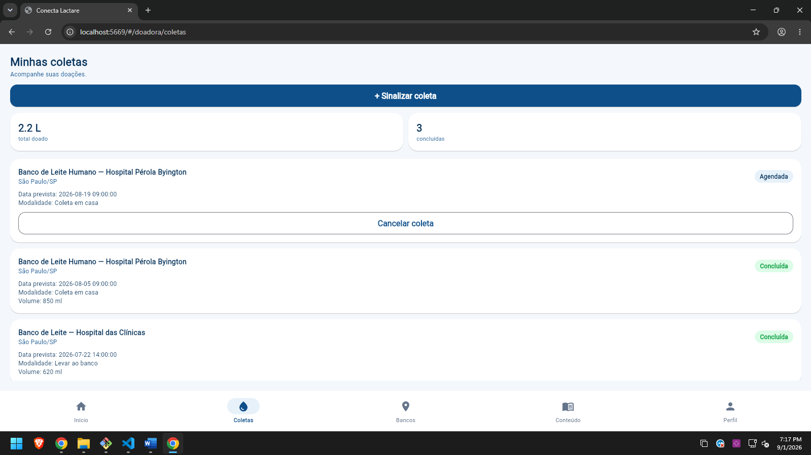 **Minhas coletas** — histórico de coletas com status (agendada/concluída), volume doado e opção de cancelar coletas pendentes. |
| 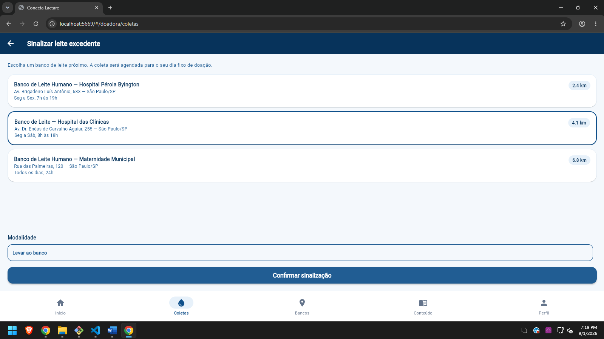 **Sinalizar coleta** — escolha do banco de leite mais próximo (com distância em km) e da modalidade de coleta (em casa ou levar ao banco). | 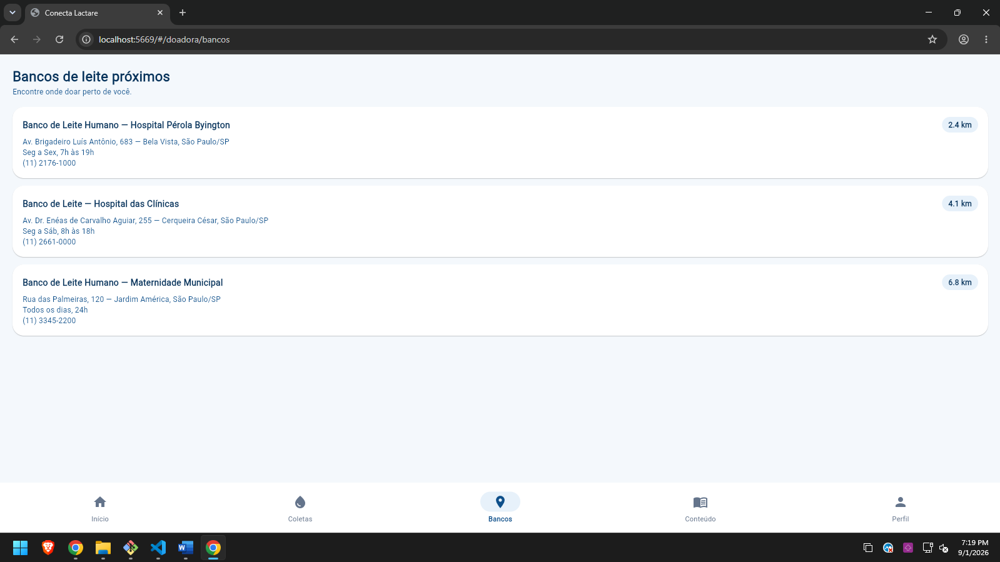 **Bancos de leite** — lista de bancos próximos com endereço, horário de funcionamento e telefone. |
| 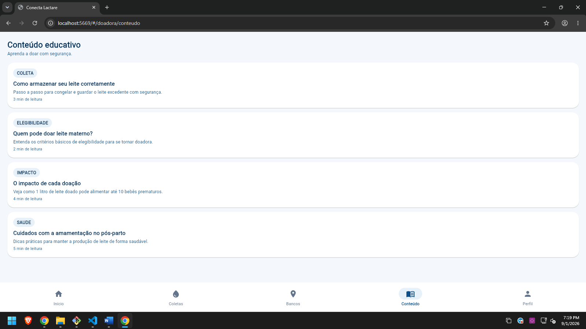 **Conteúdo educativo** — lista de artigos por categoria (Coleta, Elegibilidade, Impacto, Saúde) com tempo estimado de leitura. | 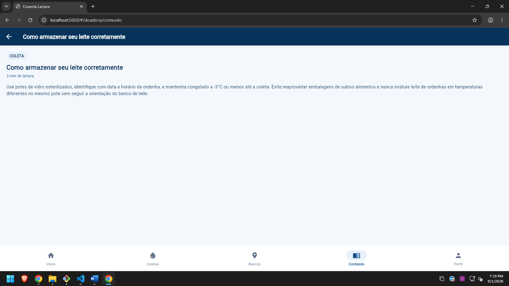 **Leitura do artigo** — tela de detalhe aberta ao tocar em um item da lista, recebendo o `slug` do conteúdo como parâmetro de rota. |
| 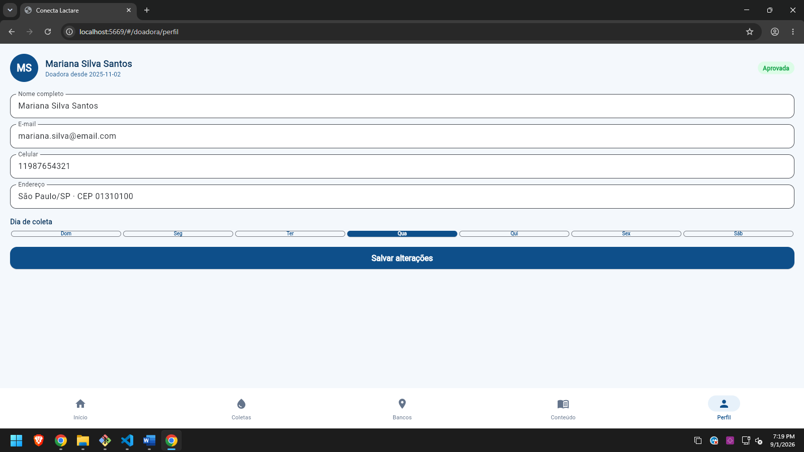 **Perfil** — dados pessoais, endereço e escolha do dia fixo de coleta na semana, com botão para salvar alterações. | |

### Área do gestor

| | |
|---|---|
| 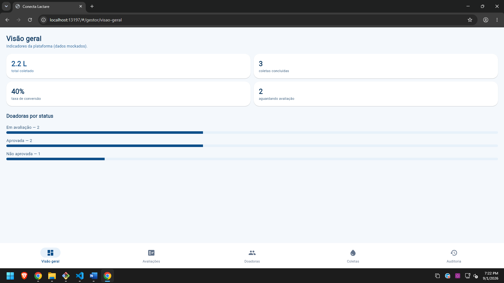 **Visão geral** — indicadores da plataforma: total coletado, coletas concluídas, taxa de conversão e distribuição de doadoras por status de avaliação. | 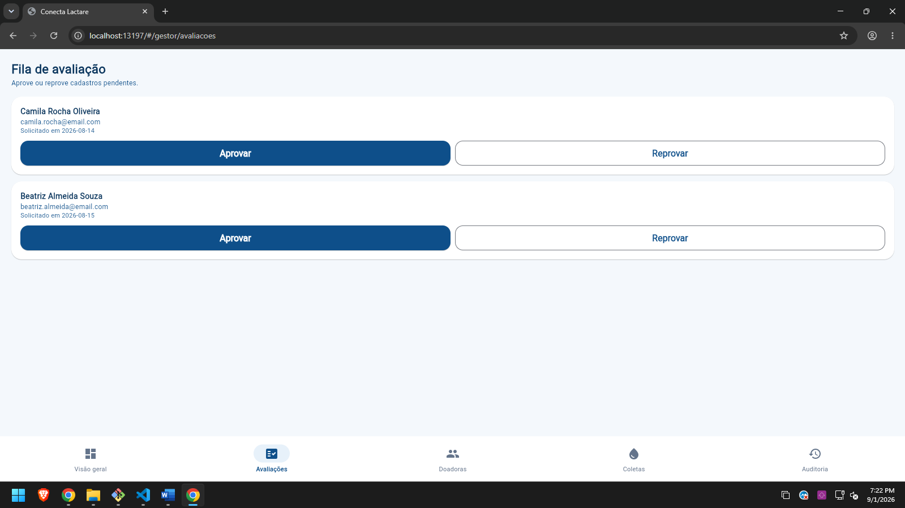 **Fila de avaliação** — lista de cadastros pendentes com ações de aprovar/reprovar. |
| 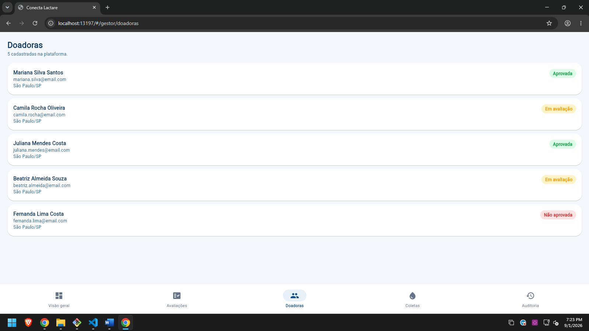 **Doadoras** — listagem de todas as doadoras cadastradas na plataforma e seus status (aprovada, em avaliação, não aprovada). | 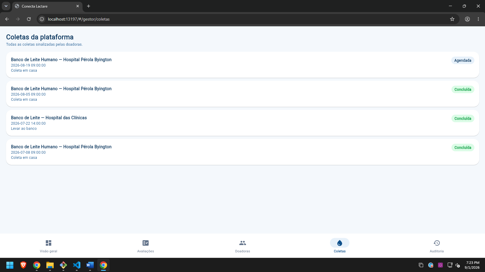 **Coletas** — todas as coletas sinalizadas por todas as doadoras, com status e modalidade. |
| 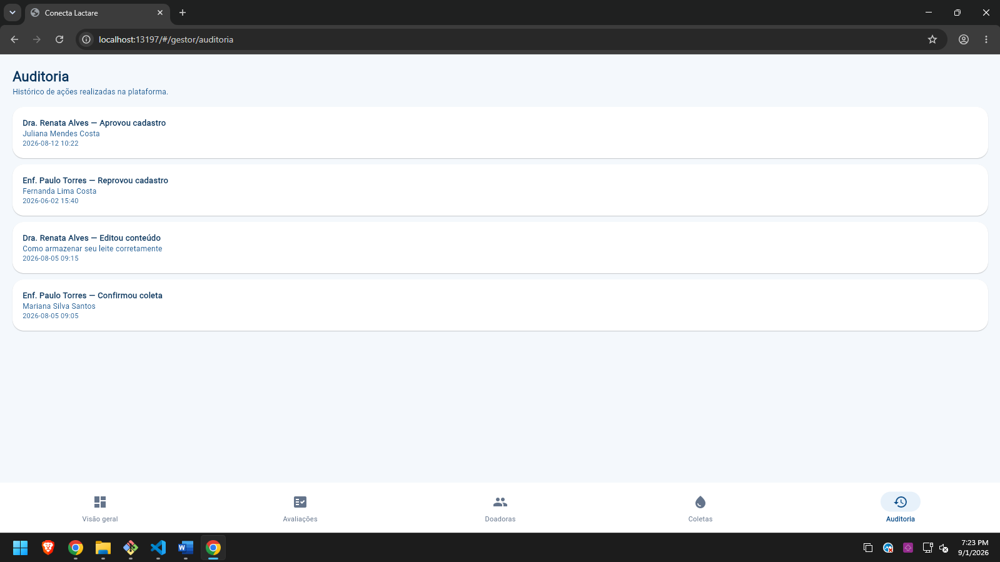 **Auditoria** — histórico de ações administrativas (aprovações, reprovações, edições de conteúdo e confirmações de coleta). | |

## Dados mockados utilizados

| Modelo | Representa | Exemplos incluídos |
|---|---|---|
| `Doadora` | Cadastro de uma doadora | 5 doadoras com nomes, e-mails, CPFs, endereços e status (`aprovada`, `pendente`, `reprovada`) |
| `BancoLeite` | Banco de leite humano parceiro | 3 bancos com nome, endereço, telefone, horário e distância |
| `Coleta` | Doação sinalizada por uma doadora | 4 coletas com datas, modalidade, status e volume em ml |
| `Conteudo` | Artigo educativo | 4 artigos com título, categoria, tempo de leitura e corpo completo |
| `ItemAvaliacao` | Item da fila de avaliação do gestor | 2 cadastros pendentes |
| `LogAuditoria` | Registro de ações administrativas | 4 logs com autor, ação, alvo e data/hora |

Nenhum dado genérico do tipo "Item 1" ou "Lorem ipsum" foi usado — todos os textos e dados têm
contexto real do domínio (endereços de São Paulo, nomes de bancos de leite reais como Hospital
Pérola Byington e Hospital das Clínicas).

## Tecnologias e dependências

- **Flutter** (SDK Dart `>=3.3.0 <4.0.0`)
- **go_router** `^14.2.0` — navegação declarativa com bottom navigation por abas
- **Material 3** — UI declarativa nativa do Flutter
- Estado gerenciado com `StatefulWidget`/`setState` e `ChangeNotifier` (sem bibliotecas externas
  de estado)

```
lib/
├── main.dart                 ← ponto de entrada do app
├── data/
│   ├── model/                ← modelos (Doadora, Coleta, BancoLeite, Conteudo, etc.)
│   └── mock/                 ← fonte única de dados mockados usada por todas as telas
├── state/                    ← estado global de sessão (papel logado, respostas do quiz)
├── navigation/                ← rotas, shells de bottom navigation e configuração do go_router
└── ui/
    ├── theme/                 ← cores e tema Material 3 (em lib/theme/)
    ├── components/             ← componentes reutilizáveis (badges, botões, cards, top bar)
    └── screens/                 ← telas organizadas por fluxo (landing, quiz, cadastro, login,
                                    doadora, gestor)
```

## Como executar o projeto

**Pré-requisitos:** [Flutter SDK](https://docs.flutter.dev/get-started/install) instalado
(canal stable) e um dispositivo/emulador Android, iOS ou navegador configurado.

1. Instale as dependências:
   ```
   flutter pub get
   ```
2. Liste os dispositivos disponíveis:
   ```
   flutter devices
   ```
3. Rode o app (emulador Android, dispositivo físico ou Chrome):
   ```
   flutter run
   ```
   ou, para rodar direto no navegador:
   ```
   flutter run -d chrome
   ```
4. Na tela inicial, toque em **"Quero doar"** para seguir o fluxo público (quiz → cadastro →
login), ou em **"Já sou doadora"** para ir direto ao login e escolher entrar como **doadora**
ou **gestor(a)** e explorar as respectivas áreas do app.

Não é necessária nenhuma configuração de API, chave ou variável de ambiente — todos os dados
exibidos são mockados localmente no próprio app.

> **Sobre o `gradlew`:** os scripts `android/gradlew`/`android/gradlew.bat` estão incluídos, mas
> o binário `gradle/wrapper/gradle-wrapper.jar` não foi versionado neste pacote. O comando
> `flutter run`/`flutter build apk` baixa e gerencia o Gradle automaticamente na primeira
> execução (é necessário acesso à internet nessa primeira vez), então normalmente não é preciso
> se preocupar com isso.